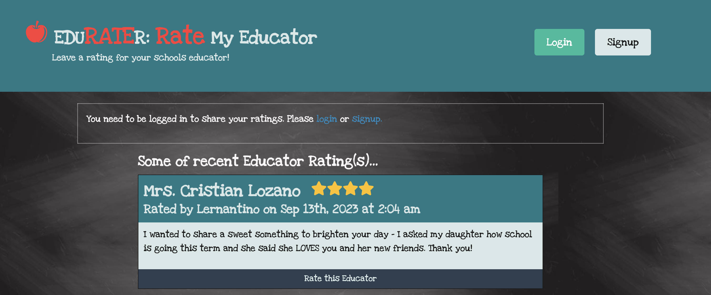

# EduRater: Rate My Educator
> Parents, students, educators, and the community always want to be informed about the staff working at elementary and high schools.  This app, EduRater, is used to rate teachers and principals.  Parents/Guardians and students can find their future teachers and principals, the community can find information about the schools in the area, and other educators can use this to find out about the work environment of their prospective teaching postions.
> Live demo [_here_](https://damp-wildwood-31060-690d212e58d9.herokuapp.com/). <!-- If you have the project hosted somewhere, include the link here. -->

## Table of Contents
* [General Info](#general-information)
* [Technologies Used](#technologies-used)
* [Features](#features)
* [Screenshots](#screenshots)
* [Setup](#setup)
* [Project Status](#project-status)
* [Room for Improvement](#room-for-improvement)
* [Acknowledgements](#acknowledgements)
* [Contact](#contact)
<!-- * [License](#license) -->

## General Information
Do you want to give a shout out to a special teacher?  Do you have a horrible principal who should not be leading the school?  Or are you looking for a job as a teacher and wondering what the school environment is like?  No matter what your situation is, EduRATEr is the place for other teachers, administrators, parents, students, and the community to rate an educator and leave honest reviews.  Give a 1-5 star rating on an educator, leave your review, and also give stars to other users’ ratings.  Elementary and high school students are our future and these bright young minds are in the hands of teachers and principals. Team Mann wanted to create a place to find out the truth of who our children are being led by. This app was built using REACT, MongoDB and Mongoose ODM. Our app is deployed on Heroku and is responsive so users can use it on the go.  

## Technologies Used
- Mongoose - version 7.0.2
- graphql - version 16.6.0
- express- version 4.17.2
- apollo - version 4.7.1
- REACT - version 18.2.0
- react-dom - version 18.2.0
- react-icons - version 4.11.0
- vite - version 4.3.2
- jwt - version 3.1.2
- MongoDB
- Bcrypt
- Node.js
- Apollo Server

## Features
List the ready features here:
- Delete a rating button
- Five star rating
- Ability to comment or rate a rating

## Screenshots

<!-- If you have screenshots you'd like to share, include them here. -->

## Setup
To start the server, first run the command `npm run install` to install all the requried dependecies.  Next, to run the seeds run the command `npm run seed`.  Finally, run the command, `npm run develop` to concurrently run the server and client. The app will open in your browser automatically. 

## Project Status
Project is: _in progress_.

## Room for Improvement

Room for improvement:
- Specific teacher/principal profile page with their average rating.
- Create an Educator model.
- Make EduRATEr data searchable with a search bar.
- Add a field to include the educator’s school to the rating.
- Use 3rd party API to include the school’s location and information.
- Delete your additional rating on the same educator.

## Acknowledgements
- Many thanks to my instuctor, Michael Pacheco, the TAs, Nirav Venkatesan and Julius Dorfman, tutor, Julio Valdez, and all of the learning assistants from AskBCS. 

[Mallorie Pinto's GitHub](https://github.com/Pinto006?tab=repositories)

[Kristine Kim's GitHub](https://github.com/kristinehkim) 

[Siavash Namiranian's GitHub](https://github.com/SiavashNamiranian)

[Elias Rivera's GitHub](https://github.com/eliasjrivera)

## Contact
Created by: 

Kristine Kim kristinehkim@gmail.com

Siavash Namiranian siavash65n@gmail.com

Mallorie Pinto malloriepinto89@gmail.com

Elias Rivera eliasjohnrivera@gmail.com

Feel free to contact us!

## License 

This project is licensed under MIT.